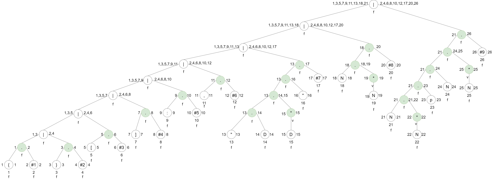
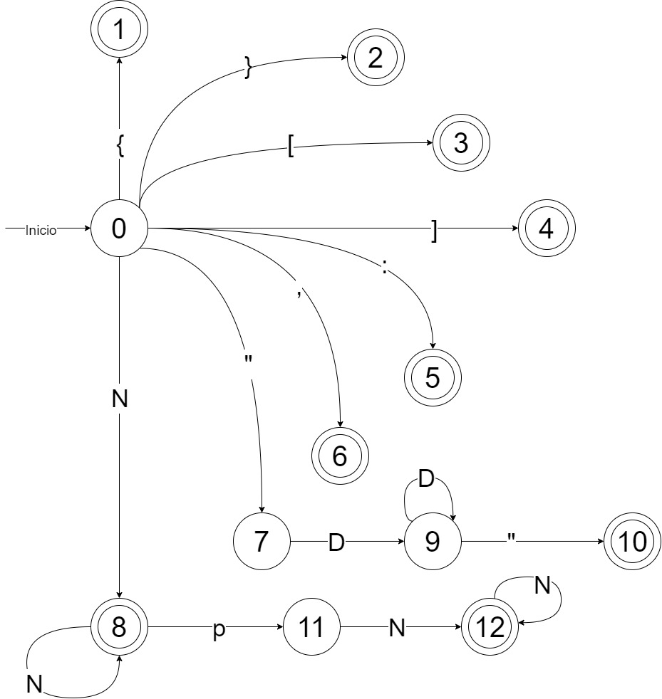

# Manual Técnico

## Descripción del proyecto
Se solicita la lectura de código fuente, el cual tendrá un formato JSON, creando un programa el cual sea capaz de identificar un lenguaje dado, identificando los errores léxicos y ejecutando las instrucciones correspondientes.

Se listarán una serie de instrucciones las cuales deben de ser ejecutadas, cumpliendo con el formato asignado, generándolo un resultado y graficarlos en un archivo según la jerarquía operacional de cada instrucción. **Colocando el resultado en cada nodo que aplique**.

Los errores deben ser generados en un archivo **JSON**.

## Índice

- [AFD](#afd)
- [Controller](#controlles)
- [Models](#models)
- [View](#view)

## AFD

### Expresión Regular
La expresión regular a partir de la cuál se realizo el AFD fue la siguiente:

```
{#1 | }#2 | [#3 | ]#4 | :#5 | ,#6 | “DD*”#7 | NN*#8 | NN*pNN*#9
```

Donde:
- `#1` = Llave izquierda
- `#2` = Llave derecha
- `#3` = Corchete izquierdo
- `#4` = Corchete derecho
- `#5` = Dos puntos
- `#6` = Coma
- `#7` = Cadena
- `#8` = Número
- `#9` = Número con punto decimal

### Método del Árbol


### Tabla de Siguiente Posición
| Nodo  | Siguiente Posición |
| ------------- |:-------------:|
| 1 | {2} |
| 2 | - |
| 3 | {4} |
| 4 | - |
| 5 | {6} |
| 6 | - |
| 7 | {8} |
| 8 | - |
| 9 | {10} |
| 10 | - |
| 11 | {12} |
| 12 | - |
| 13 | {14} |
| 14 | {15,16} |
| 15 | {15,16} |
| 16 | {17} |
| 17 | - |
| 18 | {19,20} |
| 19 | {20} |
| 20 | - |
| 21 | {22,23} |
| 22 | {22,23} |
| 23 | {24} |
| 24 | {25,26} |
| 25 | {26} |
| 26 | - |

### Tabla de Símbolos
| Nodo  | Simbolo |
| ------------- |:-------------:|
| 1 | { |
| 2 | #1 |
| 3 | } |
| 4 | #2 |
| 5 | [ |
| 6 | #3 |
| 7 | ] |
| 8 | #4 |
| 9 | : |
| 10 | #5 |
| 11 | , |
| 12 | #6 |
| 13 | " |
| 14 | D |
| 15 | D |
| 16 | " |
| 17 | #7 |
| 18 | N |
| 19 | N |
| 20 | #8 |
| 21 | N |
| 22 | N |
| 23 | p |
| 24 | N |
| 25 | N |
| 26 | #9 |

### Cálculo de Transiciones
$$ S_0= \left \{ 1, 3, 5, 7, 9, 11, 13, 18, 21 \right\}$$
$$Trans\left( S_0, \{ \right) = sig \left( 1 \right) = \left\{ 2\right\} =S_1^{*}$$
$$Trans\left( S_0, \} \right) = sig \left( 3 \right) = \left\{ 4 \right\} =S_2^{*}$$
$$Trans\left( S_0, [ \right) = sig \left( 5 \right) = \left\{ 6 \right\} =S_3^{*}$$
$$Trans\left( S_0, ] \right) = sig \left( 7 \right) = \left\{ 8 \right\} =S_4^{*}
$$
$$Trans\left( S_0, : \right) = sig \left( 9 \right) = \left\{ 10 \right\} =S_5^{*}$$
$$Trans\left( S_0, , \right) = sig \left(11 \right) = \left\{ 12 \right\} =S_6^{*}$$
$$Trans\left( S_0, ^{"} \right) = sig \left(13 \right) = \left\{ 14 \right\} =S_7$$
$$Trans\left( S_0, N \right) = sig \left(18 \right) \cup sig \left(21 \right) = \left\{ 19,20,22,23 \right\} =S_8^{*}$$
$$Trans\left( S_7, D \right) = sig \left(14 \right) = \left\{ 15,16 \right\} =S_9$$
$$Trans\left( S_9, D \right) = sig \left(15 \right) = \left\{ 15,16 \right\} =S_9$$
$$Trans\left( S_9, ^{"} \right) = sig \left(16 \right) = \left\{ 17 \right\} =S_{10}^{*}
$$
$$Trans\left( S_8, N \right) = sig \left(19 \right) \cup sig \left(22 \right)= \left\{ 20,22,23 \right\} =S_8$$
$$Trans\left( S_8, p \right) = sig \left(23 \right) = \left\{ 24 \right\} =S_{11}$$
$$Trans\left( S_{11}, N \right) = sig \left(24 \right) = \left\{ 25,26 \right\} =S_{12}^{*}$$
$$Trans\left( S_{12}, N \right) = sig \left(25 \right) = \left\{26 \right\} =S_{12}$$

### AFD


## Controller
En esta sección se encuentra la lógica del programa, la cual se encarga de la lectura del archivo, la creación de los objetos, la ejecución de las instrucciones y la generación de los archivos de salida.

### errors
Este archivo contiene una función llamada `processErrors` que se encarga de crear un archivo JSON a partir de una lista de errores. Los errores deben provenir del módulo `controller.lexer.ErrorList`.

#### Función processErrors
La función `processErrors` realiza las siguientes tareas:

1. Crea un diccionario llamado `error_dict` que contendrá los errores en formato JSON.
2. Inicializa una lista vacía de errores en el diccionario.
3. Recorre la lista de errores `ErrorList` y agrega cada error al diccionario en formato JSON con la siguiente estructura:

```json
{
    "No.": index + 1,
    "descripcion": {
        "lexema": error._lexema,
        "tipo": "Error Lexico",
        "fila": error._row,
        "columna": error._column
    }
}
```

### graphs
Este archivo contiene un conjunto de funciones que generan y representan visualmente un grafo de operaciones utilizando la biblioteca Graphviz. El grafo representa las operaciones contenidas en una lista llamada `operationList` y utiliza configuraciones definidas en `configurationSettings`.

#### Funciones

##### `make_graphviz()`
La función `make_graphviz` es la función principal que realiza las siguientes tareas:

1. Crea un objeto `Digraph` de Graphviz llamado `dot` para representar el grafo.
2. Configura las propiedades del grafo, como el título, colores, fuentes y dirección de representación.
3. Itera sobre las operaciones en `operationList` y llama al método `getResult()` de cada operación para calcular sus resultados.
4. Llama a la función `traverse_graph` para construir el grafo de manera recursiva.
5. Renderiza el grafo en un archivo 'graphs.gv' y lo visualiza.

##### `traverse_graph(dot, ope)`

La función `traverse_graph` es una función recursiva que construye el grafo de operaciones. Toma como entrada un objeto `dot` de Graphviz y una operación `ope`.

##### `nodeDefinition(dot, correlative, label, fillcolor, fontcolor, shape)`

La función `nodeDefinition` define un nodo en el grafo con propiedades como etiqueta (`label`), color de fondo (`fillcolor`), color de fuente (`fontcolor`) y forma (`shape`).

##### `edgeDefinition(dot, correlative, correlative2)`

La función `edgeDefinition` define una arista (borde) entre dos nodos en el grafo.

### lexer
Este archivo contiene la implementación de un analizador léxico (`Lexer`) para procesar una cadena de entrada y dividirla en tokens utilizando las reglas definidas. Los tokens se definen en el módulo `controller.token`.

#### Clases y Módulos Relacionados

##### Clases

- `Token`: Clase que representa un token con un tipo y un valor.
- `TokenType`: Enumeración que define los tipos de tokens disponibles.

#### Módulos Importados

- `controller.token`: Importa las clases `Token` y `TokenType` para utilizar en el análisis léxico.

- `model.Error`: Importa la clase `Error` para registrar errores léxicos encontrados durante el análisis léxico.

#### Variables Globales

- `ErrorList`: Lista que se utiliza para almacenar los errores léxicos encontrados durante el análisis léxico.

#### Clase Lexer

La clase `Lexer` es la implementación principal del analizador léxico. Realiza el análisis de una cadena de entrada y devuelve una secuencia de tokens.

#### Métodos

##### `__init__(self, source: str) -> None`

El constructor de la clase `Lexer` recibe una cadena de entrada `source`. Inicializa los atributos necesarios para el análisis léxico y llama al método `_read_character()` para preparar el primer carácter.

##### `next_token(self) -> Token`

Este método avanza en la cadena de entrada y devuelve el siguiente token encontrado. Utiliza estados internos y reglas definidas para identificar los tokens.

##### `_skipWhitespace(self) -> None`

Este método se utiliza para omitir caracteres de espacio en blanco, como espacios, tabulaciones, saltos de línea y retorno de carro, mientras avanza en la cadena.

##### `_readIdentifier(self) -> str`

Este método lee y devuelve una secuencia de caracteres que forman un identificador válido. Un identificador es una secuencia de letras y números.

##### `_readNumber(self) -> str`

Este método lee y devuelve una secuencia de caracteres que forman un número válido. Un número puede contener dígitos numéricos, un punto decimal y un signo negativo.

##### `_isLetter(self, character: str) -> bool`

Este método verifica si un carácter dado es una letra válida para identificadores.

##### `_isNumber(self, character: str) -> bool`

Este método verifica si un carácter dado es un carácter válido en un número.

### parser
Este archivo contiene la implementación de la función `start_evaluate`, que se utiliza para evaluar y construir una estructura de operaciones a partir de una lista de tokens de entrada. Además, se definen variables globales como `operationList` y `configurationSettings` que se utilizan para almacenar las operaciones y configuraciones respectivamente.

#### Clases y Módulos Relacionados

##### Clases

- `Token`: Clase que representa un token con un tipo y un valor.
- `TokenType`: Enumeración que define los tipos de tokens disponibles.

#### Variables Globales

- `operationList`: Lista que se utiliza para almacenar las operaciones construidas a partir de los tokens de entrada.

- `configurationSettings`: Instancia de la clase `Configuration` que se utiliza para almacenar configuraciones definidas en los tokens de entrada.

#### Función `start_evaluate`

La función `start_evaluate` es la implementación principal que realiza las siguientes tareas:

- Toma una lista de tokens de entrada (`tokens_input`) y una operación padre previa (`prevOperation`) opcional.

- Inicializa un índice (`index`) y una variable local `tokens` a partir de `tokens_input`.

- Crea una instancia de la clase `Operation` llamada `currentOperation` que representa una operación en curso.

- Utiliza un bucle `while` para iterar sobre los tokens en `tokens`.

- Examina cada token y realiza acciones específicas según el tipo de token y su valor. Esto incluye construir operaciones, definir configuraciones y controlar la estructura anidada de operaciones.

- Devuelve `currentOperation` al finalizar el análisis.


### repl
Este archivo contiene la implementación de la función `start_repl`, que se utiliza para realizar una evaluación interactiva de un JSON representado como una cadena. La función utiliza un analizador léxico y un parser para procesar la cadena JSON y generar una estructura de operaciones.

#### Clases y Módulos Relacionados

##### Clases

- `Lexer`: Clase que implementa un analizador léxico para dividir una cadena en tokens.

- `Token`: Clase que representa un token con un tipo y un valor.
- `TokenType`: Enumeración que define los tipos de tokens disponibles.

#### Variables Globales

- `EOF_TOKEN`: Un token especial que indica el final del archivo o cadena de entrada.

#### Función `start_repl`

La función `start_repl` es la implementación principal que realiza las siguientes tareas:

- Recibe una cadena JSON (`jsonString`) como entrada.
- Inicializa dos listas vacías: `tokens` y `tokensView`, para almacenar los tokens generados y para su visualización.
- Crea una instancia del analizador léxico (`Lexer`) llamado `lexer`.
- Utiliza un bucle `while` para obtener tokens de `lexer` hasta que se alcance el token de fin de archivo (`EOF_TOKEN`).
- Agrega cada token obtenido a las listas `tokens` y `tokensView`.
- Llama a la función `start_evaluate` para procesar los tokens y generar la estructura de operaciones correspondiente.
- Devuelve la lista `tokensView`, que contiene los tokens generados y puede ser utilizada para visualización o depuración.


### token
Este archivo define las clases `Token` y `TokenType` que se utilizan para representar y categorizar los tokens generados durante el análisis léxico de una cadena.

#### Enumeración `TokenType`

La enumeración `TokenType` define los tipos de tokens disponibles. Cada tipo de token se representa como un miembro único de la enumeración y se utiliza para identificar el tipo de contenido de un token.

Los tipos de tokens definidos incluyen:

- `ILLEGAL`: Token utilizado para representar un carácter o símbolo no válido.
- `EOF`: Token que indica el final del archivo o cadena de entrada.
- `LETTER`: Token que representa identificadores y literales de texto.
- `NUMBER`: Token que representa números.
- `COMMA`: Token que representa una coma (`,`).
- `COLON`: Token que representa dos puntos (`:`).
- `LBRACKET`: Token que representa un corchete izquierdo (`[`).
- `LBRACE`: Token que representa una llave izquierda (`{`).
- `RBRACKET`: Token que representa un corchete derecho (`]`).
- `RBRACE`: Token que representa una llave derecha (`}`).
- `PERIOD`: Token que representa un punto (`.`).

#### Clase `Token`

La clase `Token` es una NamedTuple que representa un token con un tipo y un literal asociado. Cada instancia de `Token` tiene dos atributos:

- `token_type`: El tipo de token (`TokenType`) que identifica la categoría del token.
- `literal`: El valor o contenido del token representado como una cadena de caracteres.

#### Métodos

##### `__str__(self) -> str`

El método `__str__` se utiliza para obtener una representación legible en forma de cadena del token. Devuelve una cadena que muestra el tipo y el literal del token.

##### `getLiteral(self) -> str`

El método `getLiteral` devuelve el literal del token como una cadena.

##### `getType(self) -> TokenType`

El método `getType` devuelve el tipo del token como un miembro de la enumeración `TokenType`.

## Models
En esta sección se encuentran las clases que se utilizan en el programa, las cuales son:

### Configuration
La clase `Configuration` es una clase que representa la configuración de algún aspecto de una aplicación o programa. Esta clase permite definir y almacenar configuraciones como el título, el color de fondo, el estilo de fuente y otros atributos.

#### Atributos

- `title` (str): El título o nombre de la configuración.
- `backgroundColor` (str): El color de fondo asociado con la configuración.
- `fontStyle` (str): El estilo de fuente utilizado en la configuración.
- `style` (str): Un atributo adicional de estilo relacionado con la configuración.

#### Métodos

##### `__str__(self) -> str`

Este método devuelve una representación en cadena de la instancia de `Configuration`, incluyendo todos los atributos y sus valores.

##### `getTitle(self) -> str`

Este método devuelve el título de la configuración.

##### `getBackgroundColor(self) -> str`

Este método devuelve el color de fondo de la configuración.

##### `getFontStyle(self) -> str`

Este método devuelve el estilo de fuente de la configuración.

##### `getStyle(self) -> str`

Este método devuelve el atributo de estilo adicional de la configuración.

### Error
La clase `Error` es una clase que representa un error léxico en un programa. Este tipo de error ocurre cuando se encuentra un token o lexema no válido durante el análisis léxico.

#### Atributos

- `_lexema` (str): El lexema o token que causó el error léxico.
- `_row` (int): La fila en la que se encontró el error en el programa.
- `_column` (int): La columna en la que se encontró el error en el programa.

### Operation 
La clase `Operation` es una clase que representa una operación matemática. Puede ser una operación simple, como suma o resta, o una operación compuesta que involucra otras instancias de la clase `Operation`.

#### Atributos
- `operation` (str): El tipo de operación a realizar.
- `value1` (float o Operation): El primer valor de la operación, que puede ser un número flotante o otra instancia de la clase `Operation`.
- `value2` (float o Operation): El segundo valor de la operación, que puede ser un número flotante o otra instancia de la clase `Operation`.
- `fatherOperation`: Esta propiedad no está documentada en el código, por lo que su uso y significado no están claros.

    - **traverse**: Método recursivo que retorna un _out_ de tipo string, la cual es una representación de las operaciones que se tiene que realizar por cada nodo.
    ```
    Ejemplo 1 -> [valor1]suma[valor2]
    Ejemplo 2 -> [[valor1]resta[valor2]]suma[valor2]
    ```
    - **getResult**: Método que agrega una operación a la lista de operaciones.
    - **operation_result**: Método que agrega una operación a la lista de operaciones.

#### Métodos
##### `__str__(self) -> str`

Este método devuelve una representación en cadena de la instancia de `Operation`, incluyendo el tipo de operación y los valores.

##### `traverse(self) -> str`

Este método recorre la estructura de operaciones y devuelve una cadena que representa la operación de manera legible. Utiliza recursión para manejar operaciones compuestas.

##### `getResult(self) -> float`

Este método calcula el resultado de la operación y lo devuelve como un valor flotante. Realiza cálculos teniendo en cuenta el tipo de operación definida en `operation`.

##### `operation_result(self, typeOperation='', val1=None, val2=None) -> float`

Este método realiza cálculos para operaciones específicas, como suma, resta, multiplicación, etc., y devuelve el resultado como un valor flotante. Los parámetros `typeOperation`, `val1` y `val2` se utilizan para realizar los cálculos.

## View
Este archivo define la clase `MainMenu`, que representa la interfaz gráfica de usuario (GUI) de una aplicación de análisis léxico y generación de informes para datos numéricos. La interfaz se crea utilizando el módulo `tkinter` de Python y proporciona funcionalidades para abrir, analizar y guardar archivos JSON, generar informes de errores y reportes gráficos.

### Clase `MainMenu`

La clase `MainMenu` es la clase principal que define la interfaz gráfica de usuario y sus funcionalidades. A continuación, se describen los métodos y atributos más importantes de esta clase:

#### Atributos

- `mainMenu`: La ventana principal de la aplicación creada utilizando `tkinter`.

- `originalPath`: Almacena la ruta original del archivo abierto o guardado.

#### Métodos

##### `__init__(self) -> None`

El constructor de la clase `MainMenu` inicializa la ventana principal de la aplicación con título, dimensiones, fondo y un ícono personalizado. Luego, llama al método `mainUI()` para crear la interfaz gráfica.

##### `mainUI(self)`

El método `mainUI()` crea y coloca los elementos de la interfaz gráfica, incluyendo etiquetas, botones, un editor de texto y una consola. También configura los manejadores de eventos para los botones.

##### `setConsole(self, textIn)`

Este método se utiliza para mostrar texto en la consola de la aplicación. Habilita la consola, inserta el texto especificado y luego la deshabilita nuevamente para evitar la edición.

##### `setEditor(self, text)`

El método `setEditor(self, text)` establece el contenido del editor de texto de la aplicación con el texto proporcionado.

##### `getEditor(self)`

El método `getEditor(self)` devuelve el contenido actual del editor de texto como una cadena.

##### `analyzeFile(self)`

El método `analyzeFile(self)` se llama cuando se presiona el botón "Analizar". Obtiene el contenido del editor de texto, lo analiza usando la función `start_repl` y muestra los tokens y el resultado del análisis en la consola.

##### `generateErrors(self)`

El método `generateErrors(self)` se llama cuando se presiona el botón "Errores". Genera un archivo de errores usando la función `processErrors` y muestra un mensaje en la consola indicando la ubicación del archivo de errores.

##### `generateGraphviz(self)`

El método `generateGraphviz(self)` se llama cuando se presiona el botón "Reporte". Genera un informe gráfico utilizando la función `make_graphviz` y muestra un mensaje en la consola indicando la ubicación del informe generado.

##### `openFile(self)`

El método `openFile(self)` se llama cuando se selecciona la opción "Abrir" del menú. Abre un cuadro de diálogo para seleccionar un archivo JSON, lo carga en el editor de texto y muestra un mensaje en la consola con la ubicación del archivo cargado.

##### `saveFile(self)`

El método `saveFile(self)` se llama cuando se selecciona la opción "Guardar" o se utiliza la función "Guardar" para guardar el contenido del editor de texto en el archivo original. Muestra un mensaje en la consola indicando que el archivo ha sido guardado.

##### `saveFileAs(self)`

El método `saveFileAs(self)` se llama cuando se selecciona la opción "Guardar como" del menú. Abre un cuadro de diálogo para seleccionar la ubicación y el nombre del archivo, y guarda el contenido del editor de texto en el archivo especificado. Muestra un mensaje en la consola indicando la ubicación del archivo creado o guardado.
