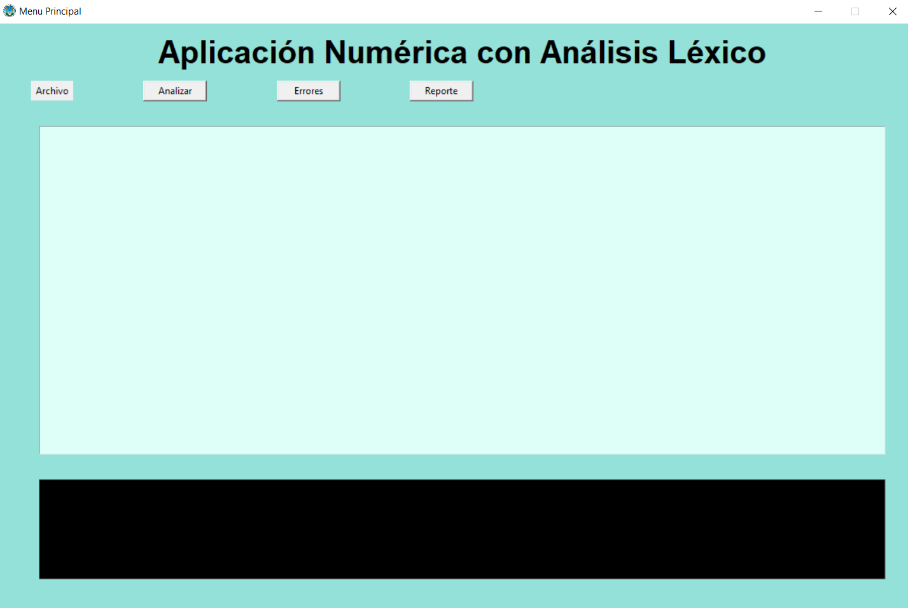
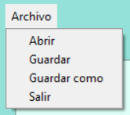
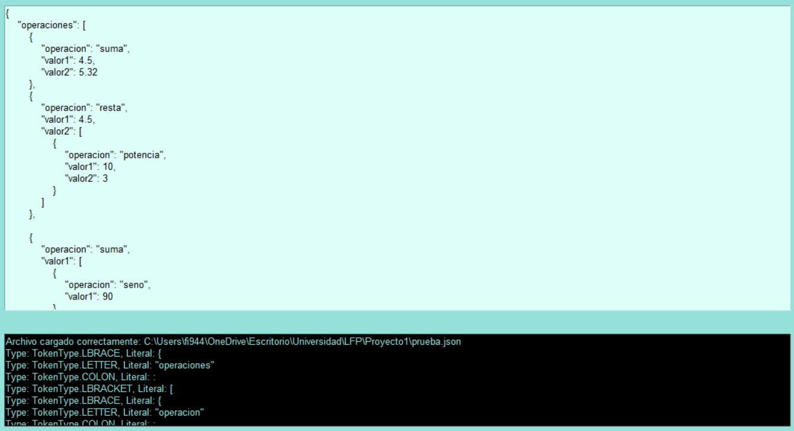
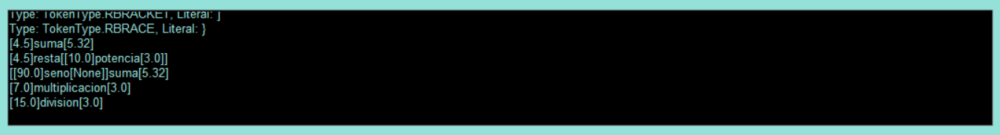
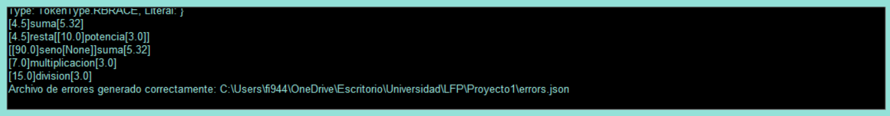
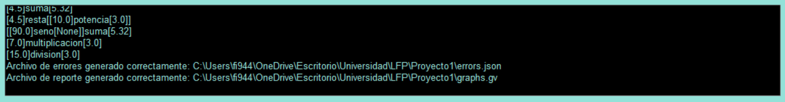

# Manual de Usuario
Unicamente se cuenta con un menú, por lo que la interacción total con el programa se realiza desde este. El menú se encuentra en la parte superior del programa, y se muestra en la siguiente imagen.

## Índice

- [Archivo](#archivo)
- [Analizar](#analizar)
- [Errores](#errores)
- [Reporte](#reporte)

## Archivo
El botón archivo nos muestra un submenú, en el cuál podemos seleccionar la opción de abrir un archivo, guardar un archivo, guardar como o salir del programa. Cada función se encuentra en su respectivo botón, y se muestra en la siguiente imagen.

## Analizar
El botón analizar lee el código que se tiene en la caja de texto, y realiza el respectivo análisis léxico y agrupa las operación en sus respectivos árboles. Todo esto es mostrado en la caja de texto negra en la parte inferior del programa.

## Errores
En este botón se realizar el archivo json, en donde se presenta cada uno de los errores que se encontraron en el código, y se muestra en la caja de texto negra en la parte inferior del programa un aviso de que el archivo ha sido creado.

## Reporte
En este botón se genera el archivo graphviz, en donde se presenta cada uno de los árboles de las operaciones que se encontraron en el código, y se muestra en la caja de texto negra en la parte inferior del programa un aviso de que el archivo ha sido creado. Así mismo, se abre una ventana en el navegador con el reporte generado.

